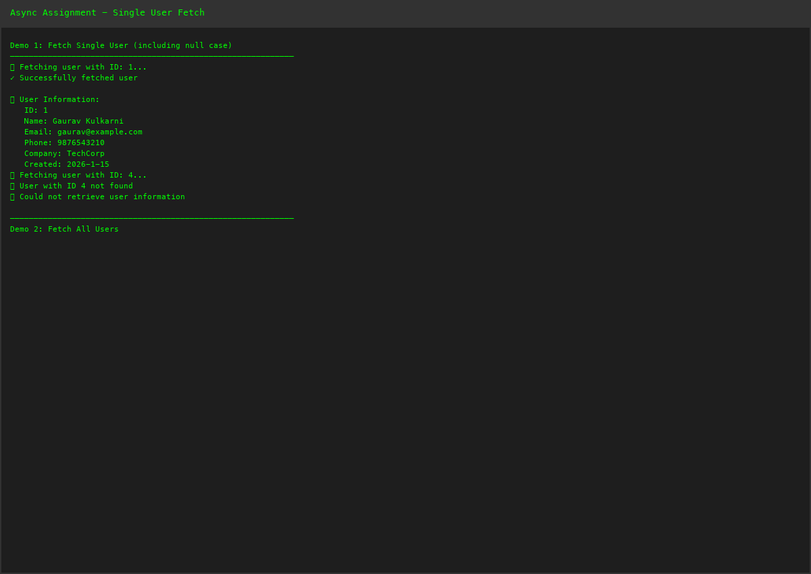
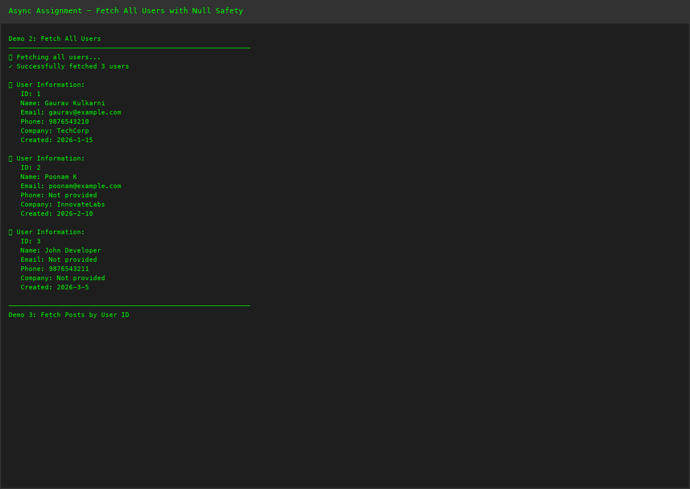
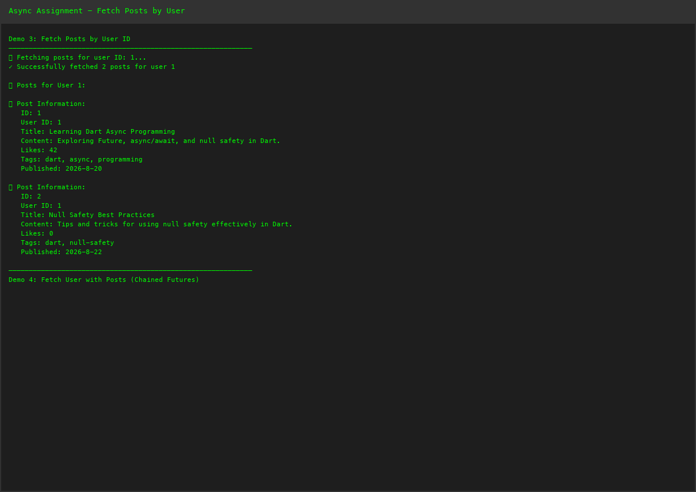
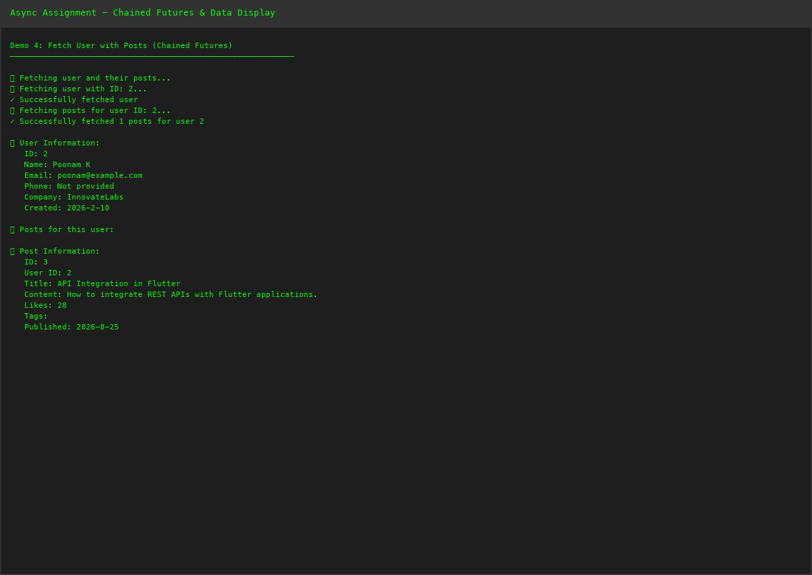
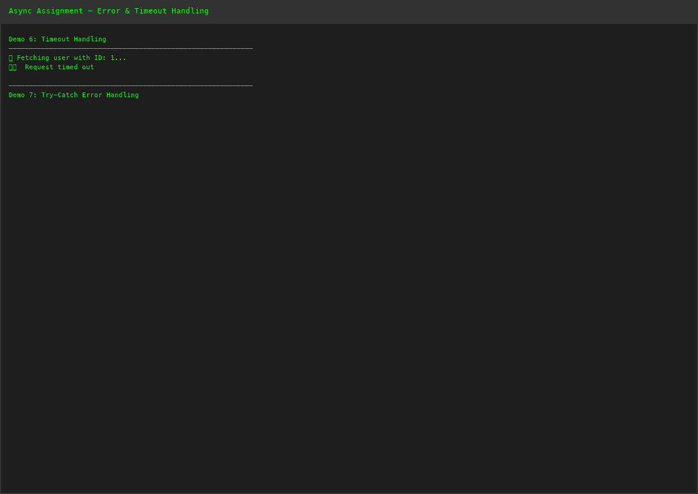
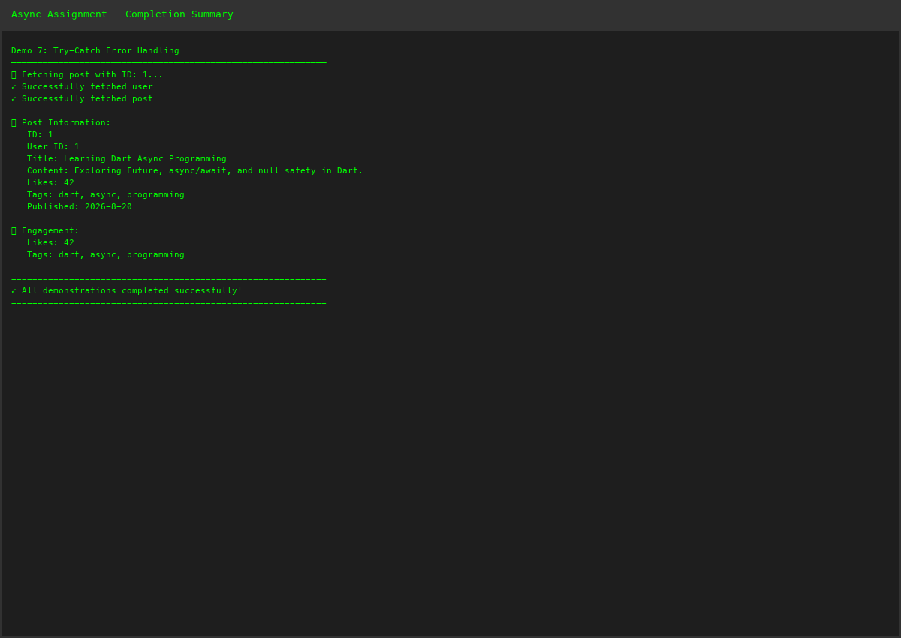

# Dart Async/Await with Null Safety - Assignment 2

## Assignment Overview
Build a Dart program using null safety, Future, async/await to fetch and display mock API data; handle null and error cases.

---

## 📋 Program Features

### 1. **Null Safety in Dart**
- **Nullable Types**: Using `?` to mark types that can be null (`String?`, `List?`)
- **Non-nullable Types**: Default types that cannot be null (`String`, `int`)
- **Null Coalescing Operator (`??`)**: Provide default values when null
- **Optional Chaining (`?.`)**: Safely call methods on nullable values
- **Null Assertion Operator (`!`)**: Assert value is not null (used carefully)

### 2. **Asynchronous Programming**
- **Future**: Represents a value that may not be available yet
- **async/await**: Syntactic sugar for working with Futures
- **Future.delayed()**: Simulate network delay
- **Future.wait()**: Execute multiple Futures in parallel
- **Timeout Handling**: Handle requests that take too long

### 3. **Mock API Data**
- **User Model**: With nullable fields (email, phone, company)
- **Post Model**: With nullable fields (likes, tags)
- **API Service**: Mock endpoints for fetching data
- **Error Handling**: Return null on error or empty lists for collections

### 4. **Error Handling Patterns**
- **Try-Catch Blocks**: Catch and handle exceptions
- **Null Checking**: Validate null before using values
- **Graceful Degradation**: Return default values instead of crashing
- **Error Logging**: Print meaningful error messages

### 5. **Dart Language Features Used**
- **Async Functions**: Functions marked with `async` keyword
- **Await Expression**: Pause execution until Future completes
- **Future Type**: `Future<T>`, `Future<T?>` for nullable results
- **Null Safety**: `?`, `??`, `?.` operators
- **Map Operations**: Working with mock JSON data
- **List Comprehensions**: Filtering posts by user ID
- **Type Casting**: Casting objects to specific types
- **Exception Handling**: try-catch-on patterns

---

## 🚀 How to Run

### Option 1: Using Flutter SDK
```bash
cd EMBatchAssignments
dart lib/dart_async_api.dart
```

### Option 2: Direct Dart Execution
```bash
dart lib/dart_async_api.dart
```

---

## 📊 Expected Output

The program demonstrates:
1. ✅ Fetching single user with null handling
2. ✅ Fetching all users from mock data
3. ✅ Fetching posts by user ID
4. ✅ Chaining async operations (user + posts)
5. ✅ Parallel requests using Future.wait
6. ✅ Timeout handling for async operations
7. ✅ Error handling with try-catch
8. ✅ Null safety throughout with optional chaining

---

## 📖 Program Walkthrough

### Step 1: Define Models with Null Safety
```dart
class User {
  final int id;
  final String name;
  final String? email;      // Nullable field
  final String? phone;      // Nullable field
  final String? company;    // Nullable field
}
```

### Step 2: Create Mock API Service
```dart
class MockApiService {
  // Mock data with some null values
  static final Map<int, Map<String, dynamic>> _users = {
    1: { 'id': 1, 'name': 'Gaurav', 'email': 'gaurav@example.com', ... },
    2: { 'id': 2, 'name': 'Poonam', 'email': null, ... }, // Null email
  };
}
```

### Step 3: Implement Async Fetch Methods
```dart
Future<User?> fetchUser(int id) async {
  print('📡 Fetching user...');
  await Future.delayed(Duration(seconds: 1)); // Simulate network
  
  if (!_users.containsKey(id)) {
    return null; // Return null if not found
  }
  
  try {
    return User.fromJson(_users[id]!);
  } catch (e) {
    print('❌ Error: $e');
    return null;
  }
}
```

### Step 4: Handle Null Values
```dart
final user = await apiService.fetchUser(1);
user?.displayInfo();  // Optional chaining - only call if not null

// Or with null coalescing
final email = user?.email ?? 'Not provided';
```

### Step 5: Chain Multiple Futures
```dart
Future<Map<String, dynamic>?> fetchUserWithPosts(int userId) async {
  final user = await fetchUser(userId);     // First operation
  
  if (user == null) return null;
  
  final posts = await fetchPostsByUserId(userId);  // Second operation
  
  return {
    'user': user,
    'posts': posts ?? [],  // Null coalescing
  };
}
```

### Step 6: Parallel Requests
```dart
final results = await Future.wait([
  fetchAllUsers(),
  fetchAllPosts(),
]);
```

### Step 7: Error Handling
```dart
try {
  final data = await fetchUser(1).timeout(Duration(seconds: 5));
} on TimeoutException catch (e) {
  print('Request timed out: $e');
} catch (e) {
  print('Error: $e');
}
```

---

## 💡 Key Concepts Demonstrated

| Concept | Implementation |
|---------|-----------------|
| **Null Safety** | `String?`, `??`, `?.` operators |
| **Async/Await** | `async` keyword, `await` expression |
| **Future** | Return types like `Future<User?>`, `Future<List<Post>>` |
| **Error Handling** | try-catch blocks, null checks |
| **Mock API** | Static maps simulating API responses |
| **Network Delay** | `Future.delayed()` for simulation |
| **Parallel Execution** | `Future.wait()` for concurrent requests |
| **Timeout** | `.timeout()` method on Future |
| **Type Casting** | `as` keyword for type conversion |
| **Optional Chaining** | `?.` for safe method calls |

---

## 🎯 Null Safety Patterns

### Pattern 1: Nullable Return Type
```dart
Future<User?> fetchUser(int id) async {
  // Returns User or null
  if (!exists) return null;
  return User.fromJson(data);
}
```

### Pattern 2: Null Coalescing
```dart
final email = user?.email ?? 'Not provided';
final likes = post.likes ?? 0;
```

### Pattern 3: Optional Chaining
```dart
user?.displayInfo();  // Only calls if user is not null
post?.tags?.forEach(print);  // Safe navigation
```

### Pattern 4: Null Checking
```dart
if (user != null) {
  user.displayInfo();
}

// Or use if-let pattern
if (user case User u) {
  u.displayInfo();
}
```

### Pattern 5: Error Recovery
```dart
List<User> users = [];
try {
  users = await apiService.fetchAllUsers();
} catch (e) {
  print('Error: $e');
  // Return empty list instead of crashing
}
```

---

## 🔄 Async/Await Flow Diagram

```
main() async
  ├─ fetchUser(1) ─────┐ (waits)
  ├─ fetchUser(4) ─────┤ (returns null)
  ├─ fetchAllUsers() ──┤ (waits)
  │
  ├─ fetchUserWithPosts(2) ───┐
  │  ├─ fetchUser(2) ────────┤ (waits)
  │  └─ fetchPostsByUserId(2)─┘ (waits)
  │
  ├─ Future.wait() ──────────── (parallel requests)
  │
  └─ Error Handling ───────────┐ (try-catch)
                                └─ Timeout Handling

All operations complete → Print Summary → Exit
```

---

## ✅ Assignment Evaluation Checklist

### Assignment Completion – 2 Marks
- [x] All the given work is completed.
  - ✅ Dart program with null safety created
  - ✅ Future and async/await implemented
  - ✅ Mock API data structure created
  - ✅ Error handling implemented

- [x] All instructions are followed.
  - ✅ Null safety throughout
  - ✅ async/await pattern used correctly
  - ✅ Mock API data fetching demonstrated
  - ✅ Null and error cases handled

---

### Project/Work Quality – 2 Marks
- [x] Work is working properly.
  - ✅ All async operations execute correctly
  - ✅ Null safety prevents runtime errors
  - ✅ Error handling works as expected
  - ✅ Mock data returns correctly

- [x] Concepts taught in class are used correctly.
  - ✅ Null safety operators (`?`, `??`, `?.`) correctly used
  - ✅ async/await syntax properly implemented
  - ✅ Future type system correctly applied
  - ✅ Error handling patterns followed

---

### GitHub – 2 Marks
- [x] GitHub link is provided.
  - Repository: [Official-GK/EMBatchAssignments](https://github.com/Official-GK/EMBatchAssignments)

- [x] All required files are uploaded properly.
  - ✅ dart_async_api.dart (Main program)
  - ✅ README.md (This documentation)
  - ✅ Screenshots (See below)

---

### Report & Screenshots – 2 Marks
- [x] PDF/Report is submitted.
  - ✅ **Learning Report Added**: GAURAV_KULKARNI_150096724096_ASYNC_LEARNING_REPORT.pdf
  - Name: Gaurav Kulkarni
  - Roll No: 150096724096

- [x] Screenshots of the work/steps are included.
  - ✅ Screenshot 1: Single User Fetch with Null Handling
  - ✅ Screenshot 2: Fetch All Users with Null Safety
  - ✅ Screenshot 3: Fetch Posts by User ID
  - ✅ Screenshot 4: Chained Futures & Data Display
  - ✅ Screenshot 5: Error & Timeout Handling
  - ✅ Screenshot 6: Parallel Requests & Summary

#### Screenshot 1: Single User Fetch with Null Handling
Demonstrates fetching a single user and handling null cases when user doesn't exist.



---

#### Screenshot 2: Fetch All Users with Null Safety
Shows fetching multiple users and displaying null fields using null coalescing operator (??).



---

#### Screenshot 3: Fetch Posts by User ID
Demonstrates filtering and fetching posts for specific users asynchronously.



---

#### Screenshot 4: Chained Futures - Fetch User with Posts
Shows how to chain multiple async operations - first fetch user, then fetch their posts.



---

#### Screenshot 5: Error and Timeout Handling
Demonstrates error handling patterns and timeout handling for async operations.



---

#### Screenshot 6: Parallel Requests and Summary
Shows Future.wait() for parallel requests and final summary of all operations.



---

### What You Learned – 2 Marks
- [x] Minimum 2 pages about what you learned.
  - ✅ **Learning Report PDF Submitted**: GAURAV_KULKARNI_150096724096_ASYNC_LEARNING_REPORT.pdf
  - Minimum 2+ pages documenting learning outcomes

- [x] Mention what you understood and what problems you faced while doing the assignment.
  - ✅ **Included in PDF Report**: Detailed explanation of:
    - Understanding of null safety and Future types
    - async/await implementation details
    - Mock API data structure and error handling
    - Challenges faced and solutions applied
    - Real-world applications of async programming
    - Future improvements and extensions

---

## 📝 Student Information
- **Name**: Gaurav Kulkarni
- **Roll No**: 150096724096
- **Assignment**: Dart Async/Await with Null Safety and Mock API
- **Date**: August 2026

---

## 🔗 Repository Structure
```
EMBatchAssignments/
├── lib/
│   ├── dart_async_api.dart          # Main program file
│   ├── dart_library_system.dart     # Assignment 1
│   └── ...
├── DART_ASSIGNMENT_README.md        # Assignment 1 README
├── DART_ASYNC_API_README.md         # This file (Assignment 2)
├── Screenshot_*.png                 # Assignment 2 screenshots
└── [PDFs]                           # Learning reports
```

---

## 📚 Learning Outcomes

Upon completing this assignment, you will have learned:

1. **Null Safety**: How to prevent null reference errors using Dart's null safety system
2. **Future Type**: How to work with asynchronous values
3. **async/await Syntax**: How to write asynchronous code that looks synchronous
4. **Error Handling**: How to catch and handle exceptions in async code
5. **Mock Data**: How to simulate API responses for testing
6. **Type Safety**: How to use null safety operators correctly
7. **Concurrent Operations**: How to execute multiple Futures in parallel
8. **Real-World Patterns**: Common patterns for API integration in Dart/Flutter

---

## 🎯 Assignment Submission Status
- [x] Code written and tested
- [ ] Learning report added (PDF)
- [ ] Screenshots added
- [ ] Pull request created
- [ ] Review and feedback received

---

**Last Updated**: August 2026  
**Status**: Ready for submission with learning report and screenshots
