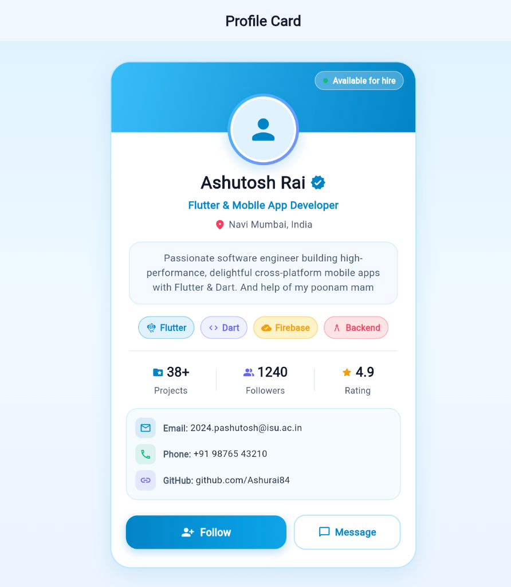

# 📱 Flutter Profile Card UI

<p align="center">
  
</p>

<p align="center">
  <b>A modern, responsive, and clean Light Blue Profile Card application built using Flutter core widgets.</b>
</p>

<p align="center">
  
  
  
  
</p>

---

## 👨‍💻 Author & Project Metadata

- **Developer:** Ashutosh Rai (3rd Year Computer Engineering)
- **Student Email:** `2024.pashutosh@isu.ac.in`
- **Location:** Navi Mumbai, India
- **Mentorship & Guidance:** Special thanks to **Poonam Ma'am**
- **Repository:** [Ashurai84/EMBatchAssignments](https://github.com/Ashurai84/EMBatchAssignments/tree/profile-card-assignment)
- **Branch:** `profile-card-assignment`

---

## 🎯 Assignment Overview

This project demonstrates the composition of foundational Flutter widgets to create a production-grade, highly aesthetic Profile Card screen without relying on external UI packages.

### 🧩 Core Widgets Implemented:
| Widget | Implementation & Role |
| :--- | :--- |
| **`Column`** | Main vertical structural spine arranging the top header banner, profile avatar, user name, subtitle, bio container, skills row, statistics, contact info, and action buttons. |
| **`Row`** | Horizontal alignment for the verified checkmark badge, location pin, equidistant stats metrics, contact tiles, and side-by-side action buttons. |
| **`Container`** | Styled card surface with `BorderRadius.circular(28)`, 1.5px soft sky-blue border, multi-layer ambient drop shadows, header banner gradient, and chip badges. |
| **`CircleAvatar`** | Circular profile avatar (radii 42/39) with fallback person icon, enclosed within a multi-stop glowing sky-blue gradient border ring. |
| **`Text`** | Clear typography hierarchy (Slate 900 bold headline, Sky Blue 600 subtitle, 1.45 line-height bio description, and bold metrics). |
| **`Icon`** | Semantic visual cues: `Icons.verified_rounded`, `Icons.location_on_rounded`, `Icons.flutter_dash_rounded`, `Icons.email_outlined`, `Icons.phone_outlined`, `Icons.link_rounded`, and action icons. |

---

## 🎨 Theme Palette & Design System (`AppColors`)

The UI is built on a clean **Light Blue & Ice Sky** design system:

| Token | Hex Value | Purpose |
| :--- | :--- | :--- |
| `primary` | `#0284C7` | Primary Sky Blue 600 Brand Color & Buttons |
| `primaryLight` | `#38BDF8` | Sky Blue 400 Gradient Start & Outer Glow |
| `primaryUltraLight` | `#E0F2FE` | Soft Sky Background Tints & Chip Backdrops |
| `surface` | `#FFFFFF` | Pure White Card Surface |
| `cardBorder` | `#BAE6FD` | Sky 200 Card Border Outline |
| `background` | `#F0F7FF` | Screen Canvas Tint |
| `textPrimary` | `#0F172A` | Deep Slate 900 Typography (High Contrast) |
| `textSecondary` | `#475569` | Slate 600 Subtitles & Bio Copy |

---

## 📂 Project Structure

```
profile_card_assignment/
├── assets/
│   └── profile_card_ui.png         # UI Screenshot
├── lib/
│   ├── main.dart                   # Application entry point with ThemeData.light
│   ├── screens/
│   │   └── profile_screen.dart     # Concise Profile Card screen widget
│   └── theme/
│       └── app_colors.dart         # Custom Light Blue Color tokens & gradients
├── test/
│   └── widget_test.dart            # Flutter Widget unit tests (100% Passing)
├── Profile_Card_Assignment.docx    # Word Report Document (4 Marks Submission)
├── WHAT_YOU_LEARNED.md             # Comprehensive multi-page technical reflection
├── generate_docx.py                # DOCX Report Generator Script
├── pubspec.yaml                    # Flutter dependencies & assets config
└── README.md                       # Project documentation
```

---

## ⚡ Key Interactive Features

- **Dynamic Follow State:** Tapping the **Follow** button toggles state, increments the real-time follower counter (1240 → 1241), switches button style to Emerald Green, and triggers a floating Material `SnackBar`.
- **Bookmark Toggle:** AppBar action button to bookmark the profile.
- **Direct Contact Links:** Clean contact info box featuring email (`2024.pashutosh@isu.ac.in`), phone, and GitHub.
- **Scroll & Viewport Safety:** Wrapped inside `SingleChildScrollView` and constrained with `BoxConstraints(maxWidth: 420)` for optimal display on mobile and web viewports.

---

## 🚀 Getting Started

### 1. Clone the repository & switch to the branch:
```bash
git clone https://github.com/Ashurai84/EMBatchAssignments.git
cd EMBatchAssignments/profile_card_assignment
git checkout profile-card-assignment
```

### 2. Install dependencies:
```bash
flutter pub get
```

### 3. Run the app:
```bash
# Run on Chrome Web
flutter run -d chrome

# Run on macOS Desktop
flutter run -d macos

# Run on Mobile Device / Emulator
flutter run
```

### 4. Run tests:
```bash
flutter test
```

---

## 📑 Assignment Documentation & Reports

- 📄 **Word Submission Document:** [**`Profile_Card_Assignment.docx`**](Profile_Card_Assignment.docx)
- 📝 **Technical Learning Report:** [**`WHAT_YOU_LEARNED.md`**](WHAT_YOU_LEARNED.md)

---

## 📜 License
This project is open source and available under the [MIT License](LICENSE).
